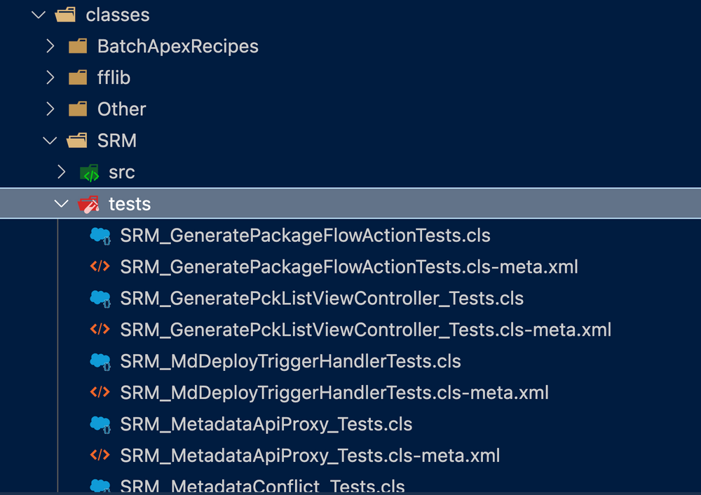

# dxfolders—Arrange your apex classes based on their prefix

[](https://www.npmjs.com/package/dxfolders) [](https://npmjs.org/package/dxfolders) [](https://raw.githubusercontent.com/salesforcecli/dxfolders/main/LICENSE.txt)

`dxfolders` is a simple `sf` plugin that automatically organises your apex classes in an sfdx folder based on their prefix and/or whether they are test classes.



<br>

It is **highly** recommended that you test this plugin in a throwaway sfdx project. Do **NOT** use it on a git-tracked project unless you've tested it somewhere else and are happy with the results.

## Installation

Run the following command to install the plugin

`sf plugins install dxfolders`

or

`sfdx plugins:install dxfolders`

If you install the plugin with `sfdx` you must execute with `sfdx`.
Likewise, if you install it with `sf` you must run it with `sf`

## Commands

`dxfolders` comes with 2 simple commands:

<!-- commands -->

- [`sf dxdir arrange`](#sf-dxdir-arrange)
- [`sf dxdir reset`](#sf-dxdir-reset)

## `sf dxdir arrange`

Arranges your apex classes based on their prefix

```
USAGE
  $ sf dxdir arrange [--json] [-d <value>]

FLAGS
  -d, --apex-dir=<value>  [default: force-app/main/default/classes] The directory where your apex class files are
                          located.

GLOBAL FLAGS
  --json  Format output as json.

DESCRIPTION
  Arranges your apex classes based on their prefix

  This command goes through all apex class files on a given location and reorganises them based on their prefix (if
  any).

  For example, if you have the following classes:

  - `SRM_Deployer.cls`
  - `SRM_DeployerTests.cls`
  - `Account_Service.cls`
  - `Account_ServiceTests.cls`

  You will end up with the following folders

  - SRM
  - src
  - tests
  - Account
  - src
  - tests

  And the classes will be moved to those folders, taking into account whether they are tests classes.

EXAMPLES
  $ sf dxdir arrange
```

## `sf dxdir reset`

Undoes the results of the previews command, i.e it flattens whatever structure you have in the target directory.

```
USAGE
  $ sf dxdir reset -o <value> -d <value> [--json]

FLAGS
  -d, --apex-dir=<value>    (required) [default: force-app/main/default/classes] The current location of the apex
                            folders and subfolders.
  -o, --output-dir=<value>  (required) [default: force-app/main/default/classes] The desired location of the flattened
                            apex files.

GLOBAL FLAGS
  --json  Format output as json.

DESCRIPTION
  Undoes the results of the previews command, i.e it flattens whatever structure you have in the target directory.

  This command goes through any subfolder in the target directory, and moves recursively moves the files to a target
  directory, thus undoing the result of the `sf dxdir arrange` command.

  You should use this is you want to revert to having all apex classes in a single directory.

EXAMPLES
  $ sf dxdir reset
```

<!-- commandsstop -->
